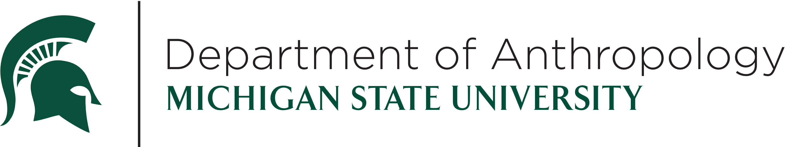
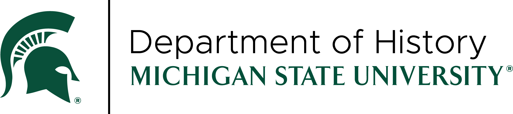

# LEADR 10
Browse our events celebrating 10 years of digital research!

## Fall 2024 Events

### LEADR10 Opening Ceremony
September 3, 4-5:30pm, LEADR Lab (Old Hort 112)

### Approaches to Community Engaged Digital Cultural Heritage - Workshop with Carrie Heitman
October 23, 9-12:00pm

### (Re)Connections Through Time: Exploring Narrative and Film in the Context of Native American Museum Collections - Lecture by Carrie Heitman
October 25, TBD

### Digital Projects in the Classroom
November 20, 8:30-10:30am, LEADR Lab (Old Hort 112)

## Spring 2025 Events

