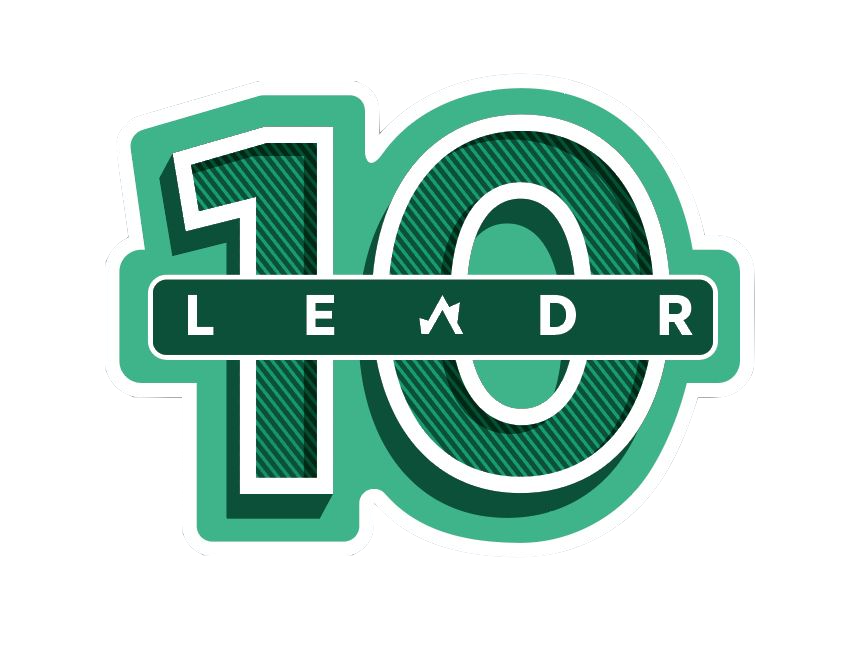

    <h1>Welcome to LEADR10</h1>

Browse our events celebrating 10 years of digital research! Find out more about LEADR on our website: [leadr.msu.edu](leadr.msu.edu)

## Fall 2024 Events

### LEADR10 Opening Ceremony
September 3, 4-5:30pm, LEADR Lab (Old Hort 112)

For more info see the flyer: [https://leadr-msu.github.io/leadr10/openingceremony](https://leadr-msu.github.io/leadr10/openingceremony)

### Approaches to Community Engaged Digital Cultural Heritage - Workshop with Carrie Heitman
October 23, 9-12:00pm, LEADR Lab (Old Hort 112)

For more info see the flyer: [https://leadr-msu.github.io/leadr10/heitmanworkshop](https://leadr-msu.github.io/leadr10/heitmanworkshop)

### (Re)Connections Through Time: Exploring Narrative and Film in the Context of Native American Museum Collections - Lecture by Carrie Heitman
October 25, 3:30pm, LEADR Lab (Old Hort 112)

For more info see the flyer: [https://leadr-msu.github.io/leadr10/heitmanlecture](https://leadr-msu.github.io/leadr10/heitmanlecture)

### Digital Projects in the Classroom
November 20, 8:30-10:30am, LEADR Lab (Old Hort 112)

For more info see the flyer: [https://leadr-msu.github.io/leadr10/digitalprojectsclassroom](https://leadr-msu.github.io/leadr10/digitalprojectsclassroom)

## Spring 2025 Events
Coming soon!

## Year-long Events

### Built Heritage Challenge
September 3, 2024 - April 9, 2025

For more information visit the website: [https://leadr-msu.github.io/builtheritage](https://leadr-msu.github.io/builtheritage)

## Our Partners 
  
